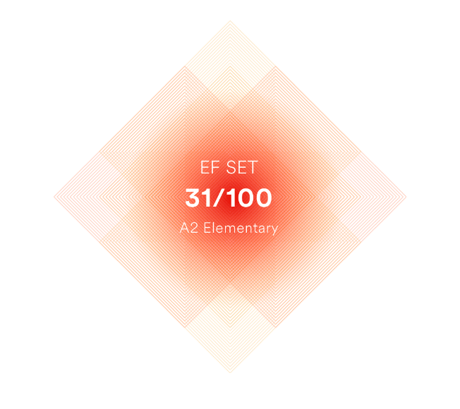

# **Christina Ermolenko**


## Contacts:

- Phone: +79101269720
- Email: Christinnenko@yandex.ru
- Telegram: @Christinnenko
- GitHub: https://github.com/Christinnenko
- Discord: christina_28534

## Skills:

- HTML5, Markdown
- CSS3 (SCSS, BEM)
- JavaScript
- Git, GitHub
- Figma, Photoshop
- API
- Bootstrap
- Scrum

## About me:

**I'm looking for remote job or internship opportunities with the potential for career growth and advancement.**

In 2020, I earned a master's degree in the area of ​​'Innovative Technologies in Human Resource Management.'
My education allowed me to accumulate 7 years of experience working for a large international company and in the Nizhny Novgorod Region government.
While serving as a team leader and chief specialist, I've developed skills like attentiveness, critical thinking, decision-making, result orientation,
communication, stress resilience, continuous self-improvement, and more.

## My projects:

- HTML+CSS+JS+date-fns library:<br>
  <https://christinnenko.github.io/webdev-cw-instapro/><br>
  <https://github.com/Christinnenko/webdev-cw-instapro>

- HTML+CSS+JS:<br>
  <https://christinnenko.github.io/webdev-dom-homework/><br>
  <https://github.com/Christinnenko/webdev-dom-homework>

- HTML+CSS+Angular:<br>
  <https://christinnenko.github.io/burgers/><br>
  <https://github.com/Christinnenko/burgers>

- HTML+SCSS:<br>
  <https://christinnenko.github.io/cosmetic_store/><br>
  <https://github.com/Christinnenko/cosmetic_store>

  ## Сode example:

The KATA from CODEWARS: Imagine you start on the 5th floor of a building, then travel down to the 2nd floor, then back up to the 8th floor. You have travelled a total of 3 + 6 = 9 floors of distance. Given an array representing a series of floors you must reach by elevator, return an integer representing the total distance travelled for visiting each floor in the array in order. Array will always contain at least 2 floors. Random tests will contain 2-20 elements in array, and floor values between 0 and 30.

```
function elevatorDistance(array) {
    let distance = 0;

    for(i = 0; i < array.length - 1; i++) {
        let result = Math.abs(array[i+1] - array[i])
        distance += result;
    }

    return distance;
}
```


## Education:

| Years     | Educational institution                                                                      | Speciality                                           |
| --------- | -------------------------------------------------------------------------------------------- | ---------------------------------------------------- |
| 2023-2024 | SKYENG                                                                                       | Web Developer                                        |
| 2017-2020 | Nizhny Novgorod State Pedagogical University named after Kozma Minin (Minin University)      | Innovative Technologies in Human Resource Management |
| 2012-2016 | Nizhny Novgorod State University named after N.I. Lobachevsky (National Research University) | Personnel Management                                 |

## Courses:

| Year | Educational institution | Сourse name                              | Certificate                                                                             |
| ---- | ----------------------- | ---------------------------------------- | --------------------------------------------------------------------------------------- |
| 2023 | ITology                 | Frontend Start                           | <https://drive.google.com/file/d/192QtN8yJM5ZrkNJli6NN-jbxhFii9rOd/view?usp=drive_link> |
| 2023 | Result School           | Marathon: 5 Days - 5 JavaScript Projects | <https://drive.google.com/file/d/14q41pJ6uzRgZE8EidFnjPor8TEfOmDNv/view?usp=drive_link> |

## Language:

- Russian - native speaker
- English - A2 Elementary (according to the online test at EFset Logo <www.efset.org>)<br>
  
